# Barkly Co.
###  *"Un gran perro, conlleva una gran responsabilidad."*

## Descripción
Una página que permite contratar superheroes que se postulan como cuidadores/entrenadores de perros, donde el usuario puede acceder al catalogo completo, con el fin de encontrar el cuidador ideal para su perro. Al momento de la elección, el usuario cuenta con un servicio de reseñas para evaluar el desempeño del superheroe calificado por anteriores clientes. Los superheroes tienen distintas caracteristicas y experiencia, que determinan la relación con el perro del cliente. Los clientes pueden contratar tantos cuidadores como cantidad de perros. Los superheroes venden distintos paquetes, los cuales son determinados por sus cualidades y la cantidad de actividades que pueda ofrecer, deben ofrecer minimo 1 y como maximo 3.

## Objetivo
El objetivo general de la página será encontrar el superheroe ideal para el fiel compañero. 

Como cliente podrás elegir entre todos los superheroes que se postulen. La página se encargará de que tengas la información necesaria para seleccionar el que más sea acorde a tus necesidades (caracteristicas y precio)

Como superheroe podes ofrecer (¡y mostrarle al mundo!) tus servicios como cuidador y entrenador de perros.

---
## Imágenes y funcionamiento de Barkly Co.

### Navbar
La navbar está en todas las páginas. Cuenta con, de izquieda a derecha, el logo de **Barkly Co.**, una barra de búsqueda junto al botón para buscar, y botones de redireccionamiento (Servicios, cuidadores, sobre nosotros y reseñas). Además de los botones de Inicio de Sesión y registrar que van cambiando si el usuario está logueado (segunda imágen) o no (primera imágen)


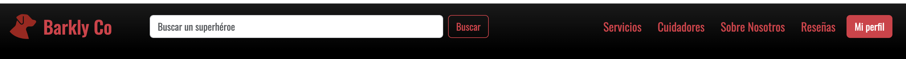

### index.html
Esta es la página principal de **Barkly Co.**, es la que brinda información a usuarios nuevos sobre nuestros servicios, quienes somos, nuestros cuidadores y algunas reseñas destacadas.
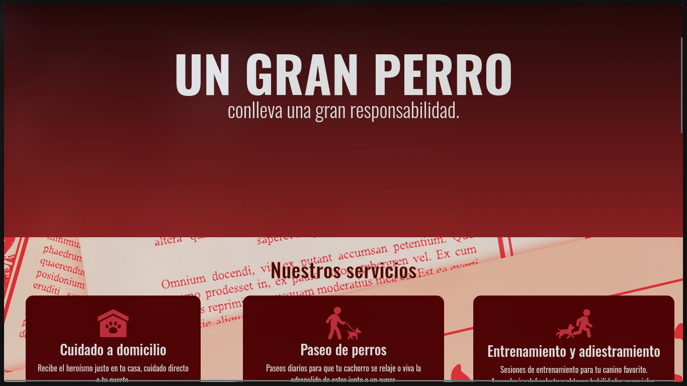
**// imagen de nuestros cuidadores**
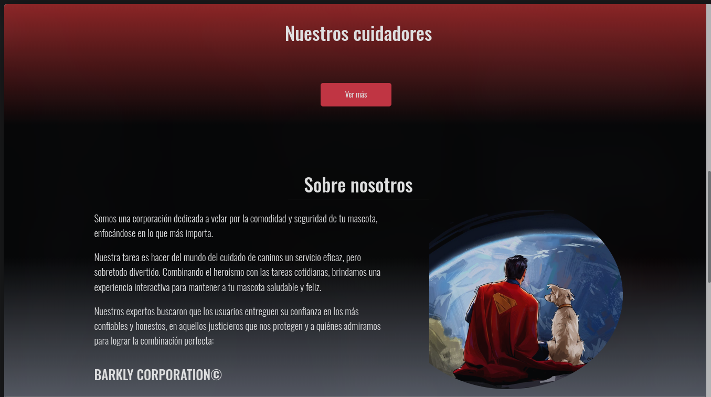
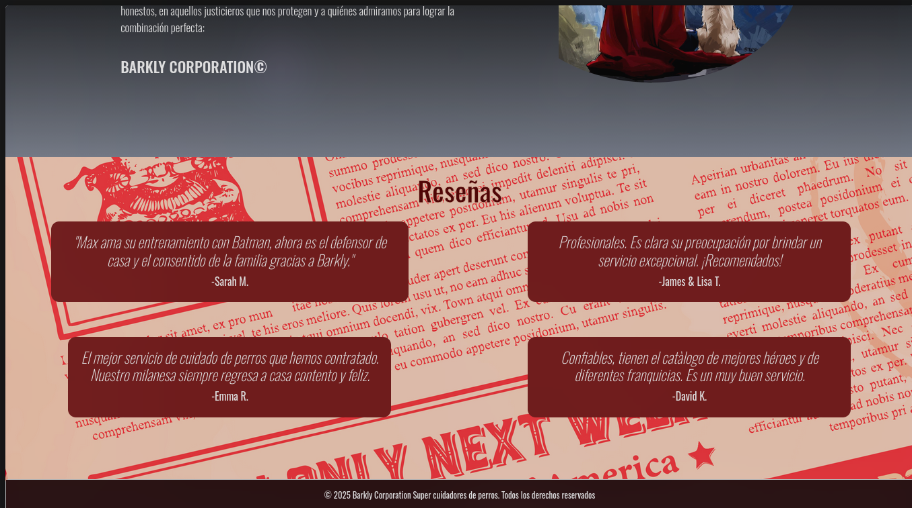

### login.html
Esta es la página de inicio de sesión. Debajo del título tenemos un enlace que nos redirecciona a una página para elegir cómo queremos registrarnos, siguiente a eso, tenemos el formulario y un selector que nos hace elegir si queremos iniciar como *usuario* o como *cuidador*.  
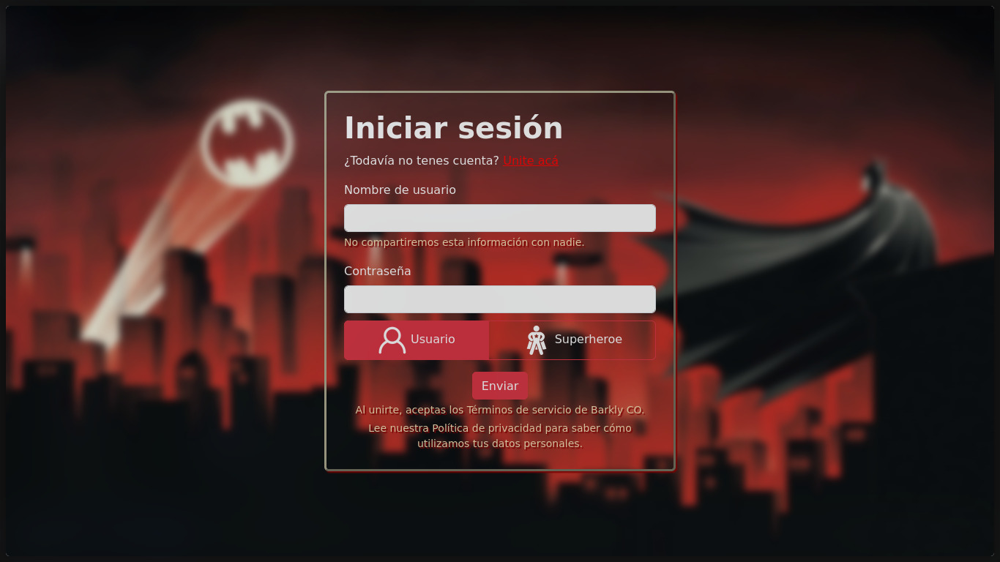

### seleccion-registro.html
Esta página se encarga únicamente de redirigirte al menú de registro que desees (usuario o cuidador) 
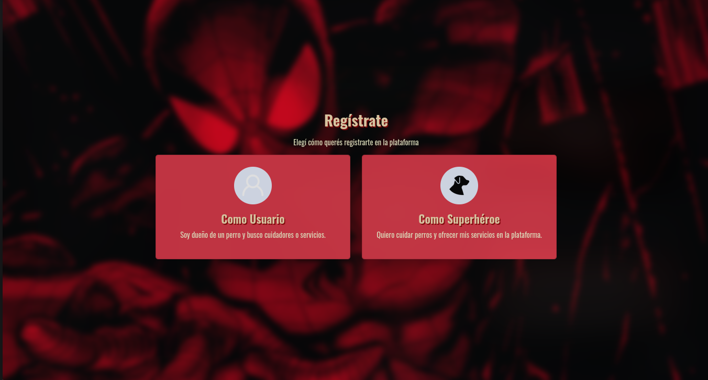

### registro-cuidador.html
Esta es la página a la que nos redirige al registrarse como *cuidador*, consiste en un formulario para completar con datos personales del cuidador y además, una imágen para el perfil y un botón para registrarse.
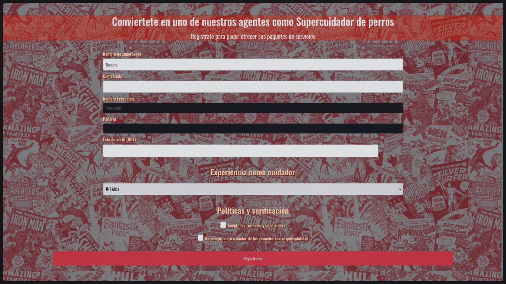

### registro-usuario.html
Esta es la página a la que nos redirige al registrarse como *usuario*, consiste en un formulario para completar con datos personales. A diferencia del cuidador, no pedimos una imágen para proteger la privacidad, debajo de todo tenemos un botón para registrarnos. 
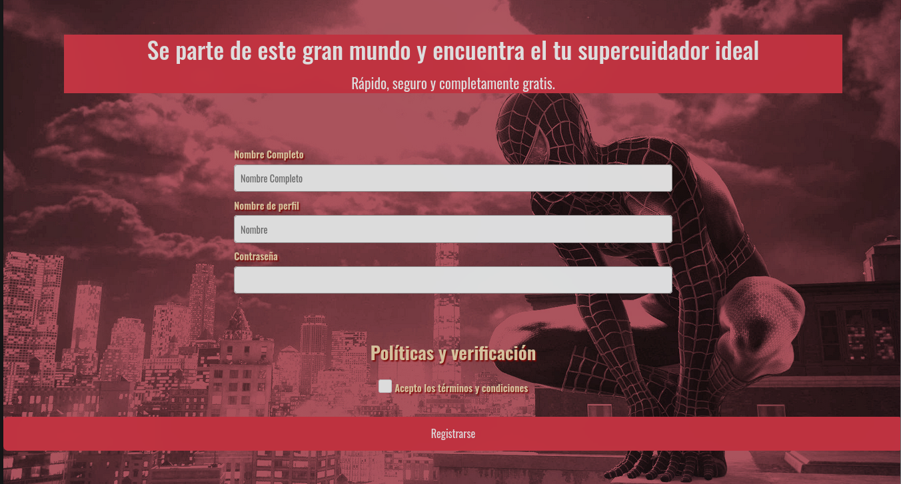

### detalles-cuidador.html
Esta es la página de **detalles-cuidador.html**, se utiliza cuando un usuario está interesado en un cuidador y decide ver sus características principales y sus reseñas, ¡además de poder incluir la tuya si querés!
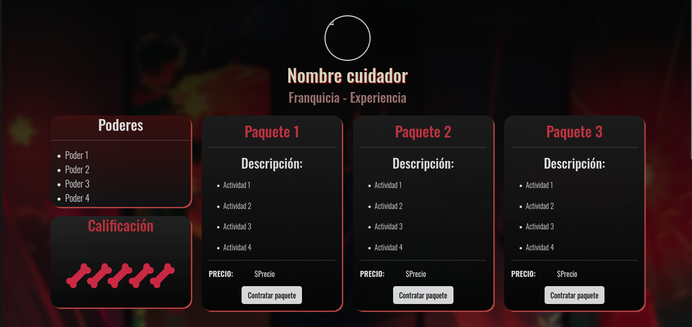
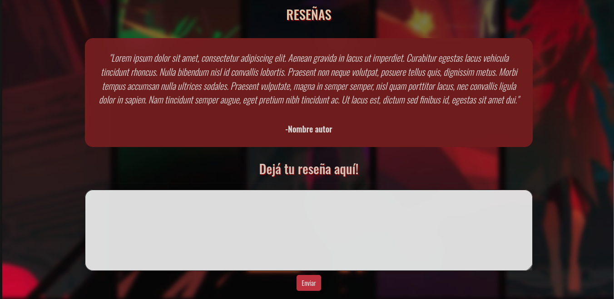

- ### perfil-cuidador.html
En la página de **perfil-cuidador.html**, tenemos el apartado de edición del perfil del *cuidador*. En esta sección, tenemos la posibilidad de editar los datos del cuidador ó de los paquetes, así como también eliminar la cuenta. 
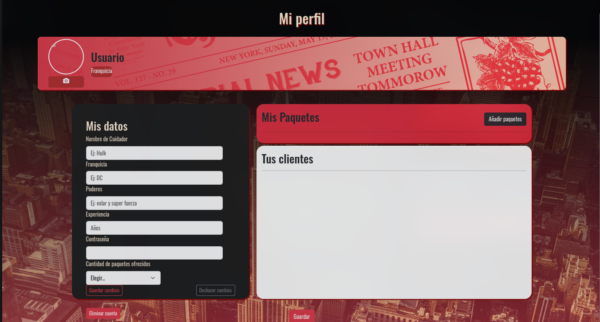

### perfil-usuario.html
En la página de **perfil-usuario.html**, tenemos el apartado de edición del perfil del *usuario*. En esta sección, tenemos la posibilidad de editar los datos del usuario ó de sus mascotas, así como también eliminar la cuenta.
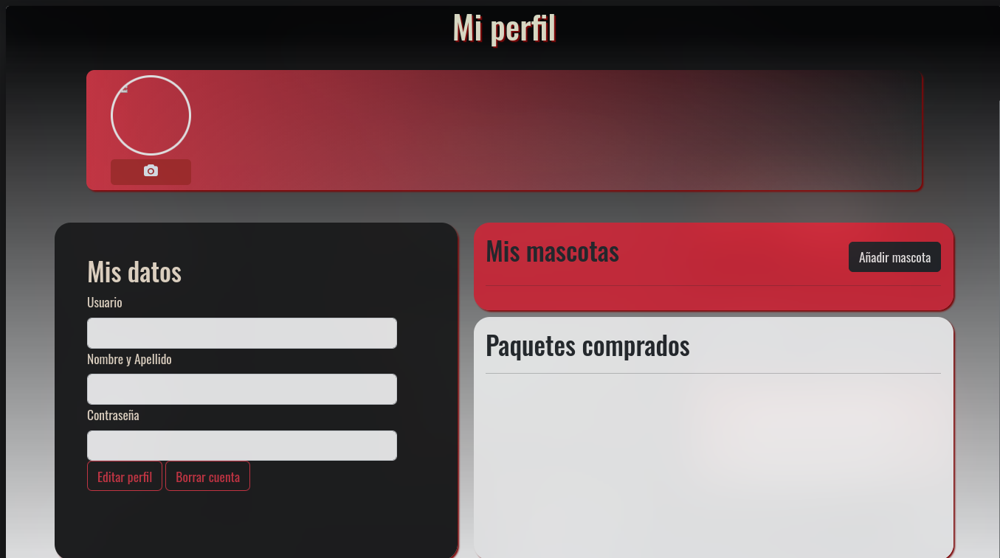

---

# ¿Cómo levantar la página?
## Backend
Para levantar el backend escribiremos la siguiente linea.
```
make run-backend
```
## Frontend
Para levantar el frontend, nos iremos a nuestro navegador favorito, al siguiente enlace:
```
https://localhost:3000/
```
**Después de haber levantado el backend.**
